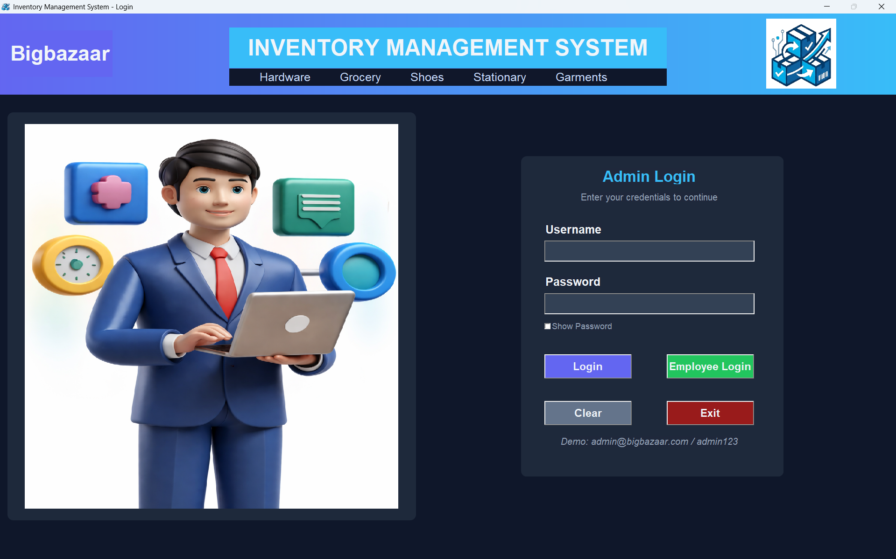
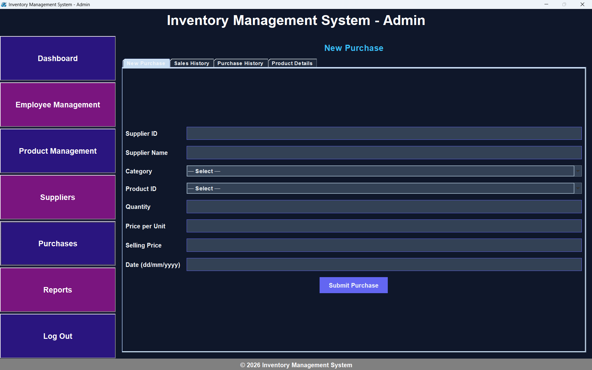

# 📦 Inventory Management System (Java AWT/Swing + MySQL)

A desktop-based **Inventory Management System** developed using **Java (AWT & Swing)** and **MySQL**.
This project helps businesses efficiently manage products, employees, suppliers, sales, and reports.

---

## 🚀 Features

### 🔐 Authentication

* Secure login system for Admin and Employees
* Role-based access

### 📊 Dashboard

* Overview of system operations
* Clean and modern UI

### 👨‍💼 Employee Management

* Add, update, delete employees
* Assign roles and categories

### 📦 Product Management

* Add new products
* Manage categories and descriptions
* Automatic entry into price & quantity tables using triggers

### 🏷️ Supplier Management

* Store supplier details
* Track supplier-product relationships

### 🛒 Sales & Purchase

* Record sales transactions
* Track purchases
* Automatic stock update

### ⚠️ Low Stock Detection

* Identifies products with low quantity
* Helps avoid stock shortages

### 💰 Profit & Loss Report

* Calculates total sales and purchases
* Displays profit/loss with date filtering
* Includes summary cards and visual indicators

### 📈 Reports Section

* Inventory insights
* Sales and purchase tracking
* Recent transactions view

---

## 🛠️ Technologies Used

* **Java (AWT & Swing)** – UI Development
* **MySQL** – Database
* **JDBC** – Database Connectivity
* **Dotenv** – Environment variable management

---

## 🗄️ Database Design

### Tables:

* `PRODUCT`
* `PRODUCT_PRICE`
* `PRODUCT_QUANTITY`
* `EMPLOYEE`
* `SUPPLIER`
* `CUSTOMER`
* `SALES`
* `PURCHASE`
* `ADMIN`

### Features:

* Foreign key constraints
* Triggers for automatic data synchronization
* Null-safe queries using `COALESCE`

---

## ⚙️ Setup Instructions

### 1. Clone the Repository

```bash
git clone https://github.com/lifelinecoding/inventory-management-system.git
cd inventory-management-system
```

### 2. Configure Environment Variables

Create a `config.properties` file in root:

```
DB_URL=jdbc:mysql://localhost:3306/your_db
DB_USERNAME=root

DB_PASSWORD=your_password
```

---

### 3. Add Dependencies

If using manual setup:

* Add MySQL Connector JAR
* Add Dotenv library

---

### 4. Run the Project

Compile and run:

```bash
javac *.java
java LoginFrame
```

---

## 🧠 Key Concepts Implemented

* Event-driven programming (AWT/Swing)
* Layout management (GridBagLayout, BorderLayout)
* JDBC connection handling
* Prepared Statements for security
* MVC-like separation
* Real-time UI updates

---

## 🎯 Future Improvements

* Add charts using libraries
* Export reports (PDF/CSV)
* Role-based permissions (advanced)
* Search & filter enhancements
* UI modernization (JavaFX)

---

## 📸 Screenshots




---

## 👨‍💻 Author

**Aditya Patel**
**Ravi Kishan Gaur**
**Vishal Singh**
**Satya Narayan**
* Computer Science Student
* Project: Inventory Management System

---

## 📄 License

This project is for educational purposes.
dded a Future Plans section with 11 upgrade ideas including:

📱 Mobile & 🌐 Web version
🔔 Low stock alerts & 📧 email notifications
📊 Advanced analytics & 🖨️ PDF export
☁️ Cloud database & 👥 multi-user roles
🔄 Barcode scanner & 🧾 GST/Tax support
